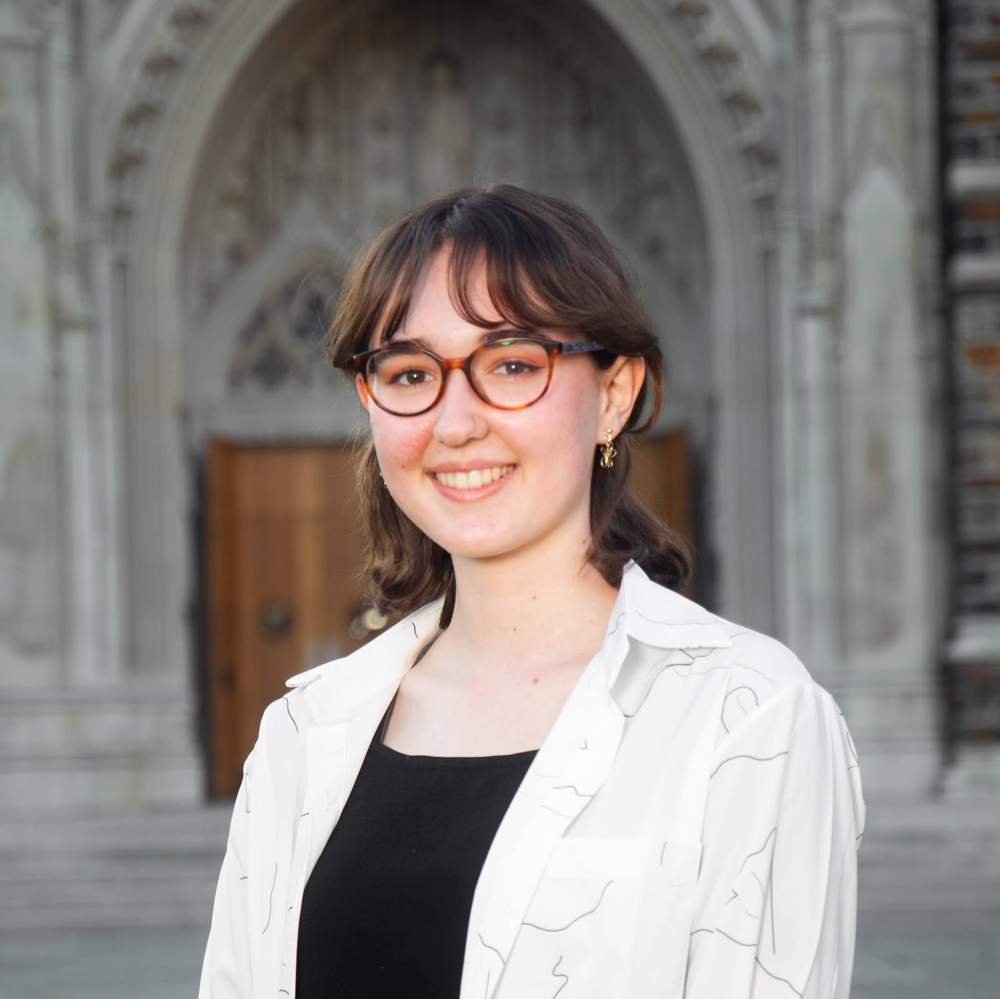

# Natalie
The Webpage for Natalie :star:

# About
Natalie is a sophomore majoring in Computation & Design, with a track in social policy, and concentration in urban design. She is interested in architecture, urban tech, and the ways the built environment affects communities. 

# Projects

[Problem Set 1] (https://github.com/Rising-Stars-by-Sunshine/Natalie/tree/main/Problem%20Set%201)
